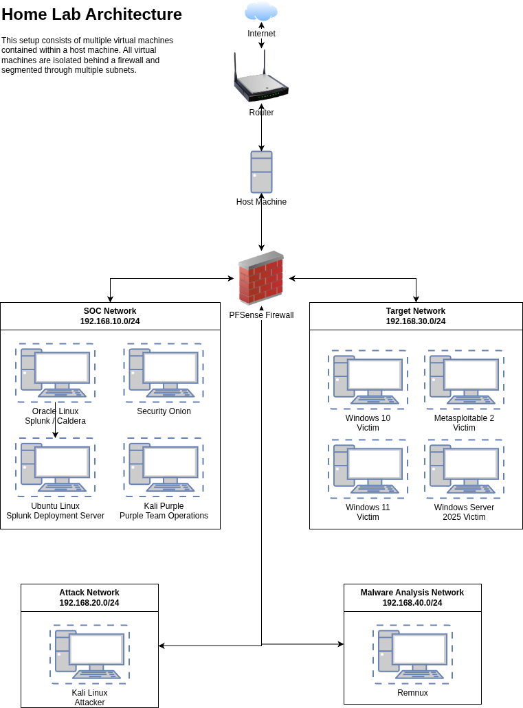
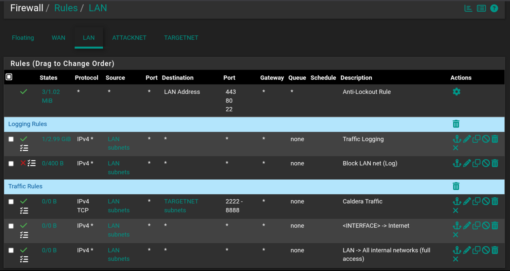

# pfSense Firewall Security Lab  
  
This project documents the deployment and configuration of a firewall using pfSense in a segmented home lab environment.   
The lab simulates a small enterprise network to demonstrate firewall configuration, network segmentation, and security monitoring.  
  
The goal of this lab is to practice and document core network security concepts including firewall rule management,   
traffic filtering, and centralized logging.  
  
This environment is integrated with a Security Information and Event Management (SIEM) platform to support monitoring   
and threat detection.  

---  
## Objectives  
  
- Deploy and configure a pfSense firewall  
- Implement network segmentation  
- Configure firewall rules and NAT  
- Forward firewall logs to a SIEM platform  
- Simulate attack traffic and observe firewall behavior  
- Document firewall operations and architecture

----
## Technologies Used

| Technology        | Purpose                      |
| ----------------- | ---------------------------- |
| pfSense           | Firewall and network gateway |
| Splunk Enterprise | Log collection and analysis  |
| Cladera           | Attack simulation            |
| Syslog            | Log forwarding               |

-----
## Network Architecture

  

The lab environment consists of segmented networks connected through the pfSense firewall.

---
## Firewall Rules

  

---
## Logging and Monitoring

Firewall events are exported to a SIEM platform using Syslog.

	pfSense → Syslog → Splunk

Collected events include:
- Allowed and blocked traffic
- Source and destination IP addresses
- Port activity
- Connection attempts

These logs support detection engineering and network monitoring activities.

---
## Security Features Enabled

- HTTPS-only web administration
- Bogon network blocking
- Firewall rule logging
- Network segmentation
- Restricted administrative access

---
## Skills Demonstrated

- Firewall deployment and configuration
- Network segmentation
- Log forwarding and monitoring
- Security event analysis
- Attack simulation and validation

---
## Author

Taji Abdullah  

Security Analyst | SOC Operations | Detection Engineering