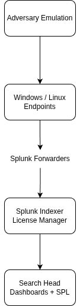

# Splunk SOC Lab – Security Engineering Architecture

## Overview
This project simulates a production-grade Security Operations Center (SOC) environment using Splunk. It demonstrates 
log ingestion, detection engineering, adversary simulation, and SIEM operations in a controlled home lab.

The goal is to mirror real-world enterprise architecture and workflows used by security engineers and SOC analysts.

---

## Architecture Summary

<div align="center">
  
</div>

### Core Components
* Splunk Enterprise (Indexer + Deployment Server + Search Head + License Manager)
* Splunk Universal Forwarders (Windows + Linux)
* Sysmon for enhanced Windows telemetry

### Data Flow
1. Endpoints generate logs
2. Universal Forwarders collect and send data
3. Splunk Indexer ingests and indexes logs
4. Search Head enables detection + analysis
5. License Manager enforces ingestion limits

---

## Features

* Centralized log collection
* Splunk Deployment Server management
* Linux log ingestion
* Windows event log monitoring
* Sysmon process and network telemetry
* Detection queries for attacker behavior
* Attack simulation testing

---

## Technologies Used

* Splunk Enterprise
* Splunk Universal Forwarder
* Sysmon
* Linux log monitoring
* Windows Event Logs
* MITRE ATT&CK detection mapping

---

## Documentation

- [Windows Universal Forwarder](docs/WindowsUniversalForwarder.md) 
- [Linux Universal Forwarder](docs/LinuxUniversalForwarder.md)
- [Deployment Server Documentation](docs/DeploymentServerDocumentation.md)
- [Deployment Commands](docs/DeploymentCommands.md)
- [Sysmon Documentaion](docs/SysmonInstallation.md)
- [Troubleshooting](docs/Troubleshooting.md)

---

## Splunk Licensing Configuration

### Overview
In a production SIEM environment, proper licensing is critical to ensure uninterrupted log ingestion and search 
capabilities. This lab includes full license configuration to simulate enterprise-scale operations.

### Why Licensing Matters
- Removes default ingestion limits
- Prevents search restrictions
- Enables realistic SOC data volume
- Aligns with enterprise deployment practices

### License Setup Process

#### Step 1 — Access Licensing
```
Settings → Licensing
```

#### Step 2 — Upload License
- Click "Add License"
- Upload `.lic` file
- Install and restart Splunk

#### Step 3 — Verify License
```bash
./splunk list licenses
```

#### Step 4 — Monitor Usage
```spl
index=_internal source=*license_usage.log
```

#### Step 5 — Detect Violations
```spl
index=_internal source=*license_usage.log type="Violation"
```

### License Architecture (Enterprise Model)

- License Manager centrally controls usage
- Indexers report consumption
- Violations tracked across all nodes

In this lab:
- Single-node deployment acts as License Manager + Indexer

### Validation Results
- License successfully installed
- No ingestion limits encountered
- Forwarders sending logs at full capacity
- Internal logs confirm usage tracking

---

## Deployment Server Configuration

Apps are deployed using Splunk server classes.

Example serverclass configuration:

```
[serverClass:all_forwarders]
whitelist.0 = *

[serverClass:all_forwarders:app:TA_base_forwarder]

[serverClass:linux_servers]
whitelist.0 = linux*

[serverClass:linux_servers:app:TA_linux_logs]

[serverClass:windows_servers]
whitelist.0 = win*

[serverClass:windows_servers:app:TA_windows_logs]

[serverClass:windows_sysmon]
whitelist.0 = win*

[serverClass:windows_sysmon:app:TA_sysmon_logs]
```

---

## Example Logs Collected

Linux

* /var/log/syslog
* /var/log/auth.log

Windows

* Security Event Log
* System Event Log
* Application Event Log

Sysmon

* Process creation
* Network connections
* Persistence activity

---

## Detection Examples

Example detection query for suspicious PowerShell:

```
index=windows EventCode=4688
| search powershell
| stats count by CommandLine, host
```

---

## Attack Simulation

Attack activity is simulated using Caldera to generate realistic adversary behavior.

This allows validation of detection rules against known attack techniques.

---

## Project Goals

* Build a realistic SOC monitoring environment
* Practice detection engineering
* Understand log pipelines and telemetry sources
* Develop practical Splunk administration skills

---

## Future Improvements

* Detection dashboards
* Automated alerts
* Threat hunting queries
* Integration with MITRE ATT&CK framework
