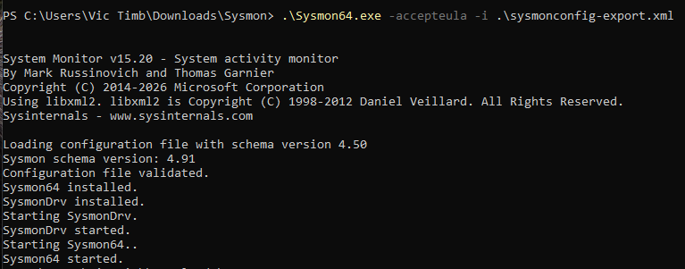
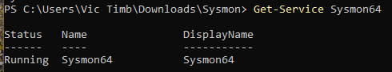

# Sysmon Deployment & Telemetry Engineering  
  
### Overview  

This project documents the deployment and configuration of Sysmon (System Monitor) to enhance endpoint visibility   
within a SOC lab environment.  
  
Sysmon extends native Windows logging by providing high-fidelity telemetry used for:  
- Threat detection  
- Incident response  
- Behavioral analysis  
- SIEM ingestion (Splunk)  
  
---  
  
## Why Sysmon Matters  
  
Default Windows logs are not enough. Sysmon fills critical gaps:  
  
| Capability | Native Logs | Sysmon |  
|----------|--------|--------|  
| Process Creation | Limited | ✅ Detailed (command-line, parent PID) |  
| Network Connections | ❌ | ✅ |  
| File Creation Time Changes | ❌ | ✅ |  
| Registry Monitoring | ❌ | ✅ |  
| Hashing (MD5/SHA256) | ❌ | ✅ |  
  
This is the difference between basic logging and detection engineering telemetry.  
  
---  
  
## Architecture Integration  
  
[insert diagram]  
  
---  
  
## Installation Steps  
  
### 1. Download Sysmon  
```commandline  
wget https://download.sysinternals.com/files/Sysmon.zip  
unzip Sysmon.zip  
cd Sysmon  
```  
Or download manually from Microsoft Sysinternals.  
[Sysmon Documentation](https://learn.microsoft.com/en-us/sysinternals/downloads/sysmon)
  
### 2. Obtain Configuration File  
Use a production-grade config:  
- SwiftOnSecurity Sysmon config  
- Olaf Hartong modular config  
  
Example: ```sysmon-config.xml```  
  
### 3. Install Sysmon  
```commandline  
Sysmon64.exe -accepteula -i sysmon-config.xml  
```  

<div align="center">
  
</div>
  
Verify installation:  
```commandline  
Get-Service Sysmon64  
```  

<div align="center">
  
</div>
  
### 4. Confirm Logging  
Navigate in Event Viewer:  
```commandline  
Applications and Services Logs  
→ Microsoft  
→ Windows  
→ Sysmon  
→ Operational  
```  
  
---    
## Key Event IDs for Detection Engineering

| Event ID | Description                                  |
| -------- | -------------------------------------------- |
| 1        | Process Creation                             |
| 3        | Network Connection                           |
| 7        | Image Loaded                                 |
| 10       | Process Access(Credential Dumping detection) |
| 11       | File Created                                 |
| 13       | Registry Modification                        |
| 22       | DNS Query                                    |

---

## Splunk Integration

Sysmon logs are forwarded via Splunk Universal Forwarder.

---

## Example Detections (Splunk SPL)

Suspicious PowerShell Execution:
```commandline
index=sysmon EventCode=1
| search CommandLine="*powershell*" AND CommandLine="*-enc*"
```

Network Connection to External IP:


## Validation

Generate test activity:
```commandline
powershell -enc SQBFAFgAIAAoAE4AZQB3AC0ATwBiAGoAZQBjAHQAKQ==
```
Then confirm logs appear in Splunk.

---

## Security Engineering Considerations

- Avoid logging everything (reduces noise)
- Tune configuration to minimize false positives
- Monitor endpoint performance impact
- Version control Sysmon configuration