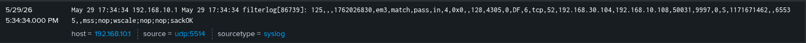

# Troubleshooting

## Common issues that prevent app deployment

- Hostname does not match server class whitelist.
- Deployment server not reloaded after configuration changes.
- Forwarder not connected to deployment server.
- App missing configuration files (empty apps will not deploy).
- Incorrect permissions on deployment-apps directory.

---

## Verification

On Linux forwarders:

    ```ls /opt/splunkforwarder/etc/apps```

On Windows forwarders:

    ```C:\Program Files\SplunkUniversalForwarder\etc\apps```

Expected apps:

TA_base_forwarder
TA_linux_logs
TA_windows_logs
TA_sysmon_logs

---

## Required Ports

These ports should be open on the machine hosting Splunk ES / Caldera

| Port | Usage                    |
| ---- |--------------------------|
| 9997 | Splunk Forwarding        |
| 8089 | Splunk Deployment Server |
| 5514 | pfSense Logs             |
| 8888 | Caldera Sandcat Agent    |

---

## TA-pfSense

When installing this addon, it wont seem to parse correctly. There is a double timestamp.

> 

The fis is to set ```no_appending_timestamp = true```
