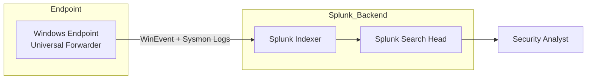
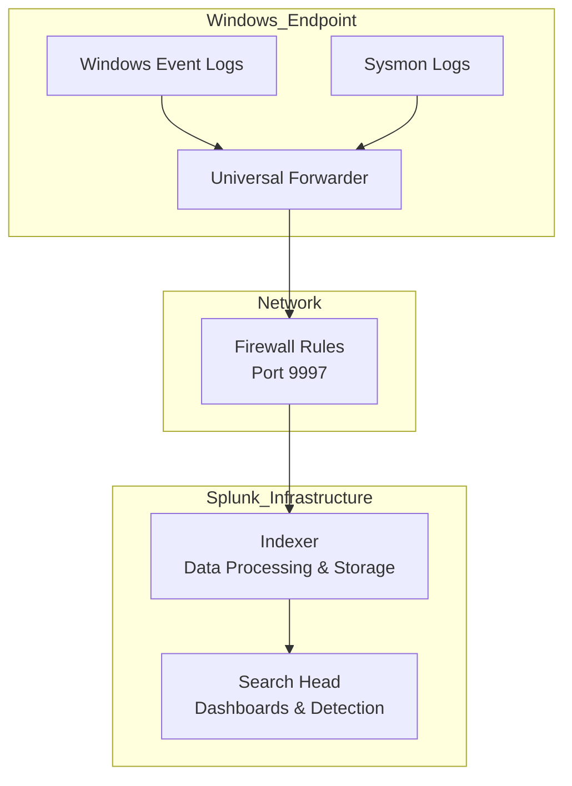

<div align="center">

# Windows Splunk Universal Forwarder Deployment

### Enterprise-Style Log Ingestion Pipeline | Home SOC Lab

</div>

---

# Overview

This project documents the deployment and configuration of the Splunk Universal Forwarder on Windows endpoints within a 
simulated enterprise SOC environment.

The objective is to build a **reliable, scalable log ingestion pipeline** that feeds endpoint telemetry into a 
centralized SIEM for detection engineering and threat hunting.

---

# Enterprise Architecture

## High-Level Diagram



---

## Detailed Security Architecture



---

# Prerequisites

* Windows 10/11 system
* Splunk Indexer configured and reachable
* Port **9997** open on indexer
* Administrative privileges
* Sysmon (recommended for advanced telemetry)

---

# Installation

## 1. Silent Installation (Production Method)

```powershell
msiexec.exe /i splunkforwarder.msi AGREETOLICENSE=Yes /quiet
```

---

## 2. Enable Boot Start

```powershell
cd "C:\Program Files\SplunkUniversalForwarder\bin"
.\splunk enable boot-start
```

---

# Configuration

## outputs.conf

```ini
[tcpout]
defaultGroup = indexer_group

[tcpout:indexer_group]
server = <INDEXER_IP>:9997
```

---

## inputs.conf

### Windows Logs

```ini
[WinEventLog://Security]
index = wineventlog

[WinEventLog://System]
index = wineventlog

[WinEventLog://Application]
index = wineventlog
```

### Sysmon Logs

```ini
[WinEventLog://Microsoft-Windows-Sysmon/Operational]
index = sysmon
```

---

## Restart Forwarder

```powershell
.\splunk restart
```

---

# Verification

## On Forwarder

```powershell
.\splunk list forward-server
```

Expected Output:

```
Active forwards:
    <INDEXER_IP>:9997
```

---

## On Splunk

```spl
index=wineventlog
```

```spl
index=sysmon
```

---

# Troubleshooting

## No Logs in Splunk

* Firewall blocking port 9997
* Incorrect index configuration
* Forwarder service not running

---

## Forwarder Not Connecting

```powershell
.\splunk list forward-server
```

* Misconfigured outputs.conf
* Network/DNS issue

---

## Permission Issues

* Ensure PowerShell is running as Administrator

---

# Security Considerations

* Enable SSL for log forwarding
* Restrict indexer ingestion ports
* Use strong authentication
* Avoid default credentials

---

# Advanced Enhancements

## Deployment Server Integration

Centralize forwarder configuration using:

* deployment-apps/
* serverclass.conf

---

## Detection Engineering Integration

* Build detection rules on Sysmon logs
* Create dashboards for:

  * Process creation
  * Privilege escalation
  * Lateral movement

---

## Attack Simulation

Integrate with adversary emulation tools to validate detections.

---

# Skills Demonstrated

* SIEM Engineering
* Log Pipeline Architecture
* Windows Event Logging
* Sysmon Telemetry
* Troubleshooting & Debugging
* Detection Engineering Foundations

---

# Key Takeaway

This project demonstrates more than installation — it shows the ability to design, deploy, and validate a **real-world 
log ingestion pipeline** used in modern SOC environments.

---

<div align="center">

### Built for Security Engineering Excellence

</div>
